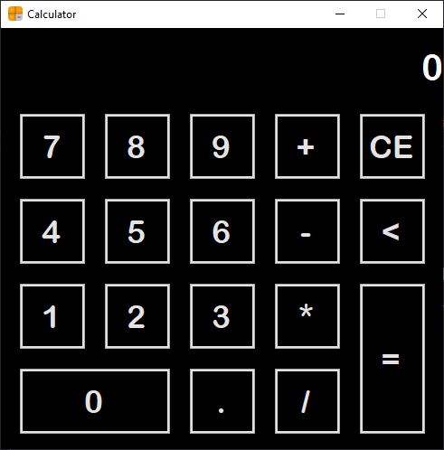

# DotNetCalculator

## Como usar

- Baixe e instale [.NET Desktop Runtime 6.0.15](https://dotnet.microsoft.com/download/dotnet/6.0).
- Baixe um [lançamento](https://github.com/Gorniaky/DotNetCalculator/releases).
- Extraia o arquivo executável e o execute.
